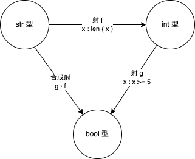
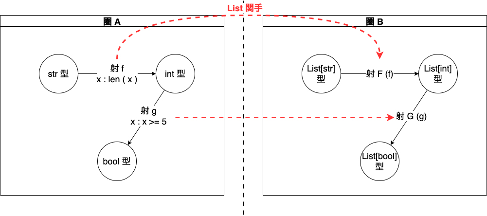
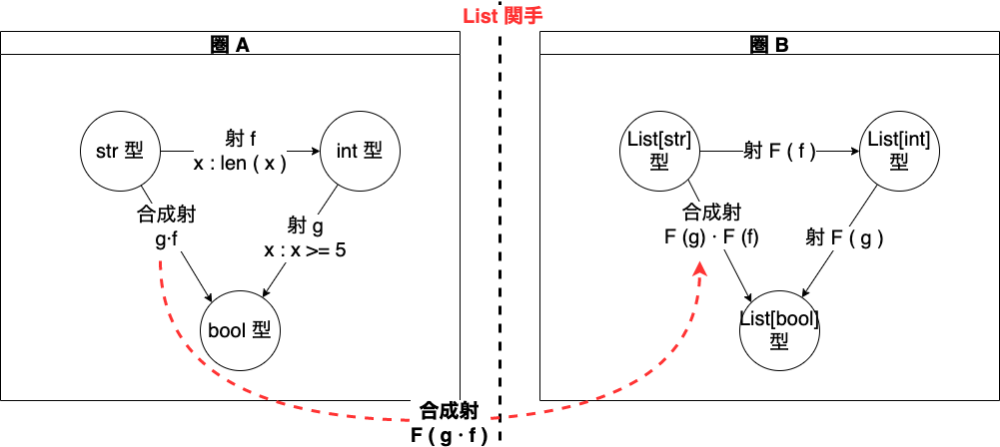
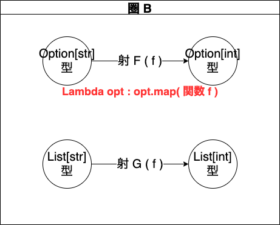
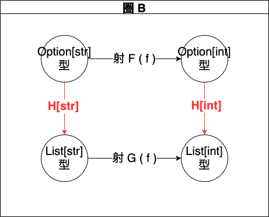
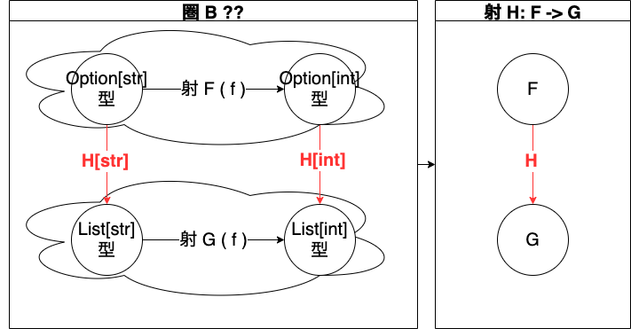

# 概要
- 「Pythonで始める柔らかな圏論: 読む、作る、分かる!!(永遠の相 World Structure 著)」の読書メモ
  - 挫折させない
  - ざっくりとした説明
  - 圏論を初めて学習する方のための参考書
  - 数学記号の記載はなるべく避ける
  - Pythonを利用して解説する

上記のような目標を掲げていて、かつ Kindle で 100円 だったため購入した。


---
# 対象と射 まとめ

1. 集合の要素を、圏論では対象という
2. 対象同士に関係性がある場合、対象から対象に向かって矢印を書く
3. 矢印を射という
4. 圏論は、対象と射の構造を研究する学問

---

# 合成射

[合成射.py](./合成射.py) では 「ある対象が別の対象の一部」(対象は文字列)という関係における合成射を Python で確認した。

---

# 圏の公理

1. 対象を持つこと
2. 射を持つこと
3. 合成射を持つこと
4. 結合律を持つこと
5. 恒等射を持つこと

---

# 「圏」かどうかの検証

`1, 2, 5, 10`は圏かどうか。

圏の公理に従って、チェックする。

圏の公理

1. 対象を持つこと → OK
2. 射を持つこと
   - 例えば不等式 `1 <= 2 <= 5 <= 10` が成り立つ。
   - 不等式を射とする。
   - → OK
3. 合成射を持つこと
   - `1 →f→ 2 →g→ 5 →h→ 10`
   - 射f と 射g を合成したとして、不等式は成り立つか？成り立つ。
   - → OK
4. 結合律を持つこと
5. 恒等射を持つこと

---

# 合成射の記述方法 合成演算子

### dot(`·`) の入力方法
- Mac は unicode を記述できるため、dot(`·`)を使えるが、これは半角中黒点(`･`)と区別できない。unicode 上は、それぞれ`\u00b7`, `\uff65` であり、別の記号である。注意したい。
- Mac の場合、dot(`·`)は Shift + option + 9 キーを同時に押す。
参考資料 https://www.geoff-hart.com/resources/accents-mac.pdf
- Markdown ならば、TeX の記述方法が使える場合が多いため、`$g \cdot f$`と記述して、 $g \cdot f$ と表記できる。

---

### dot(`·`) の読み方
- dot(`·`)の読み方だが、youtube 等で英語の発話を見ると、`g·f`を`ジーアフターエフ`と読んでいる。ドット とか、サークルとか、とくに記号を読んでいるように見えなかった。意味としても" f のあとの g "ということで通りが良いため、自分も英語で `アフター` と呼ぶことにする。

```
g · f
```

$g \cdot f$

---

### 関数としての記述方法

(圏論が表現するのは関数だけにとどまらないが、)関数に置き換えると

```
h · g · f
```

は

```
h(g(f(x)))
```

と記述できる。

---
# 恒等射
- 難しいので飛ばしてもいいらしい。

### 恒等射の定義

1. 全ての対象がそれぞれ保持している
2. 対象「1」の恒等射(id_1)と 射f を合成すると 射f になる
3. 射f と対象「2」の恒等射(id_2)を合成すると 射f になる
4. $f · id_1 = f = id_2 · f$

**自分から自分へ向かう射が、無条件で恒等射と言えるわけではない** ← そうなの

4. $f · id_1 = f = id_2 · f$

つまり、対象「1」から対象「2」への射を実行するとき、 射f のあとに 恒等射を行うか、恒等射のあとに 射f を行うか、どちらでも同じことであるということ。

恒等射 id_1 の候補

対象「1」の恒等射(id_1)の候補は `1 <= 1`

この場合、不等式は成り立つため、恒等射もなりたつ。

---

# 圏と言えるかどうかの結論

圏の公理 を全て満たすことを確認した。よって、今まで見てきた集合`1, 2, 5, 10`は圏である。

1. 対象を持つこと
2. 射を持つこと
3. 合成射を持つこと
4. 結合律を持つこと
5. 恒等射を持つこと

`対象が「数字」で射が「不等号」という圏`である。

---

- python で恒等射について確認する→[恒等射.py](./恒等射.py)を参照


---

# Python の型と関数の圏

「圏論の関手」を理解するために必要となる。

「対象が Python の型で、射が Python の関数の圏」を考える。

---
# 合成関数

[関数の合成.py](./関数の合成.py)を参照

値のフロー

1. f(str 型 "Book")
2. g(int 型 5)
3. True

図: 関数の合成



**Python では Lambda 式を使って簡単に引数に関数を受け取って、関数を組み合わせて関数を返す関数を実装できる。**

```python
def compose(fn1, fn2):
    return lambda x: fn2(fn1(x))
```


---

# 関手

**関手とは、ある圏から別の圏へ対象と射の構造を保存して写すこと。**

(ざっくりというとそうらしい。)

1. ある圏の対象と射の構造を、別の圏へ写す。
2. 構造を保持して写す。

関手の学習はパズルのようなもの(らしい)


図 List 関手





- List 関手によって対象を圏 A から圏 B に写した。→[関手_2.py](./関手_2.py)を参照
- 対象を写したので、次に射を写す。

---

# 射 f にも 射 g にも適応できる関数 F

- 以下の関数F の中に定義された関数 tmp は引数 List を受け取って、別の List を返す。

関数 tmp のような実装(クロージャー)をすることで、射 f にも 射 g にも 関数 F を適応して、圏 A から 圏 B に射を写すことができる。

```python
def F(fn):
    def tmp(xlist):
        return [fn(x) for x in xlist]
    return tmp
```

---

# 関手の定義

## 合成射 g·f は、List 関手によりどうなる？

- 射 f,g は List 関手により 射 F(f), 射 F(g) と写せた。
- 合成射 g·f は 射 F(g·f) とできるのか？
- また、圏 B で新しくできた射 F(f), 射 F(g)の合成射 F(g)·F(f) は射 F(g·f) と等しいのか？

結論は、関手の定義から言って、 `F(g)·F(f) = F(g·f)`が成り立つ必要がある。成り立たない場合、関手ではない。


---

# Python による実装
射 F(f), 射 F(g)の合成射 F(g)·F(f) は射 F(g·f) と等しいことを確認した。→[関手_合成射.py](./関手_合成射.py)を参照

```python
def F(fn):
    def tmp(xlist):
        return [fn(x) for x in xlist]
    return tmp


def compose(fn1, fn2):
    return lambda x: fn2(fn1(x))


def main():
    # 圏 A の射 f
    f = lambda x: len(x)

    # 圏 A の射 g
    g = lambda y: y >= 5

    # 圏 A の List[str]
    B_x = ["Book", "Books"]

    # F(g) · F(f)
    F_g_F_f = compose(F(f), F(g))

    # F(g·f)
    F_g_f = F(compose(f, g))
    # 値を確認
    print(f"F_g_F_f\t=\t{F_g_F_f(B_x)}") # [False, True]
    print(f"F_g_f\t=\t{F_g_f(B_x)}") # [False, True]


if __name__ == "__main__":
    main()
```

# 自作クラス(Option) 関手 の解説

自作クラス(Option) 関手を実装するために、関数 G(f) を定義する。

1. Option インスタンスを受け取る
2. Option インスタンスから要素を取得する
3. 要素に対し、関数 f を実行する
4. 実行結果を要素として、新しい Option インスタンスを生成する

---

# Option 関手,  List 関手

図 Option 関手



- Option 関手 の G(f) は実装としては、lambda 関数を用いている。
- lambda は 引数として Option インスタンスを受け取る。
- Option インスタンスの map 関数 を実行し、map 関数の戻り値をそのまま返す。


```python
class Option:
    def __init__(self, data) -> None:
        self.data = data

    def get(self):
        return self.data

    def map(self, fn):
        return Option(fn(self.get()))


def G(fn):
    return lambda opt: opt.map(fn)


def f(x):
    return len(x)


# 圏B の対象 Option[str]
B_x = Option("Books")

G_f = G(f)

print(G_f(B_x).get())
```

## Optionクラス map 関数の実装

```python
def map(self, fn):
    return Option(fn(self.get()))
```

- map 関数ははじめに、Optionクラスの `_data` フィールドの値を得る。
- 得た値を、関数に渡す。
- 関数の戻り値で Option インスタンス生成する。
- map 関数から戻された Option インスタンスは、lambda 関数の戻り値となる。


## 射の実装

1. 圏 A の射 f に相当する関数 f を、List の要素や Option の要素を引数にして実装
2. 実行結果を新しい List や Option の要素として代入する。
3. 新しい List や Option を返す。

重要なのは、それぞれに処理を行ったあと、最終的には Option の要素にすること。

---

# 自然変換

さらに、Option 関手と List 関手の対象の間に矢印 H を追加する。

図：自然変換



この H は G から F への射と言える。(らしい)

$H:G → F$




### 自然変換

$F(F) \cdot H[str] = H[int] \cdot G(f)$

上記の式が成り立つとき、H を自然変換という。

これは道順が違ってもスタートとゴールが同じみたいなイメージ？


```python

def H(option):
    return option.tolist()

# 圏 B の対象 Option[str]
B_x = Option('Books')

# H[int] · G(f)
H_G_F = compose(G(f), H)

# F(f)·H[str]
F_f_H = compose(H, F(f))

print(H_G_f(B_x)[0])
print(F_f_H(B_x)[0])

```

上記の2つが同じ結果になっていることが、python スクリプト[自然変換.py](./自然変換.py)実行でわかる。

これにより、自然変換を確認した。


# まとめ

この本で、python の型変換により、圏論の基礎的が概念の一部を python を使って学べた。以降は、[Category Theory for Programmer](https://bartoszmilewski.com/2014/10/28/category-theory-for-programmers-the-preface/)等を使って学びたい。

# 参考資料
主な参考元

- category theory for python: yomutukuruwakaru (Japanese Edition). Kindle Edition.

本来読みたかったが、断念した本

- category theory for programmers https://bartoszmilewski.com/2014/10/28/category-theory-for-programmers-the-preface/
  - 有志による翻訳版：プログラマのための圏論 https://zenn.dev/taketo1024/books/850b20937af93b

